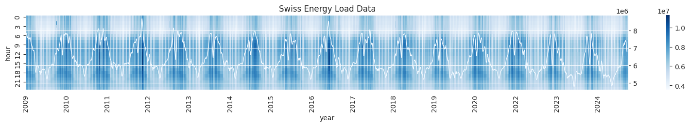
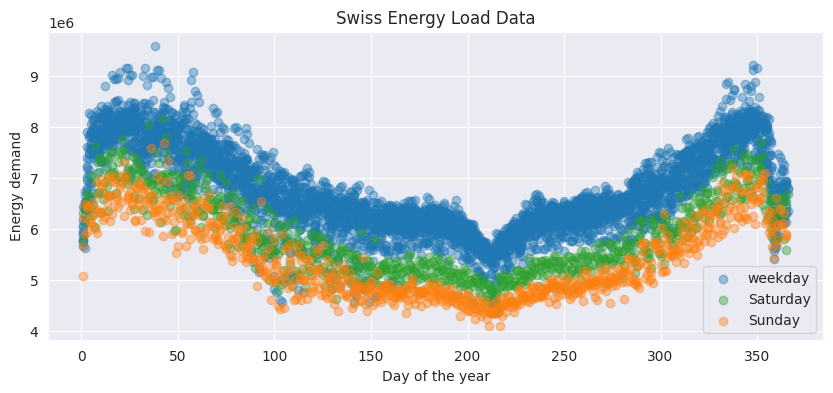

# Improving Electric Load Demand Forecasting With Hard Representation Regularization

This repository contains the data and scrips used to generate the dataset presented in the paper _Improving Electric Load Demand Forecasting With
Hard Representation Regularization_ (Nousi & Tzelepi 2025). Namely the dataset consists of Swiss Electricity Demand data combined with weather data 
in a format similar to pre-existing Electrical Load Demand Forecasting (ELDF) datasets.

The weather data were collected from [Open Meteo](https://www.open-meteo.com) using the following parameters:
```shell
curl "https://archive-api.open-meteo.com/v1/era5?latitude=47.37&longitude=8.54&start_date=2024-01-01&end_date=2024-12-31&hourly=temperature_2m" > temperature_2024.json
```

They were then combined with electricity demand data collected from [SwissGrid](https://www.swissgrid.ch/en/home.html).
The years 2009-2022 were used for model training, 2023 was used for validation and 2024 was used for testing.
Details about the proposed model can be found in the [paper](energy_demand_ch.pdf). 
The raw Excel and JSON files are given in [data/ch](data/ch) as well as the processed [swiss_energy_data.csv](data/ch/swiss_energy_data.csv) 
and the script used to process the raw files ([utils/dataset.py](utils/dataset.py)).

## Visualization

The following graph shows the Swiss electricity demand data, with hours shown on the y-axis and days shown on the x-axis, over the span of 16 years (mean daily demand value shown in light blue).


The distribution of the proposed dataset per day of the year, with colors highlighting whether each day is a weekday or a day of the weekend is shown below.


## Benchmarks

| Method         | MAPE         |
|----------------|--------------|
| Baseline (MLP) | 2.82 +- 0.10 |
| HRR (ours)     | 2.68 +- 0.01 |
| [AFORE](https://ieeexplore.ieee.org/document/10096754) | 2.70 +- 0.01 |
| AFORE + HRR | 2.66 +- 0.01 |

## Citation

If you use this data please cite the following paper.
```
@inproceedings{nousi2025improving,
  title={Improving Electric Load Demand Forecasting With Hard Representation Regularization},
  author={Nousi, Paraskevi and Tzelepi, Maria},
  booktitle={European Signal Processing Conference (EUSIPCO) 2025},
  year={2025}
}
```

